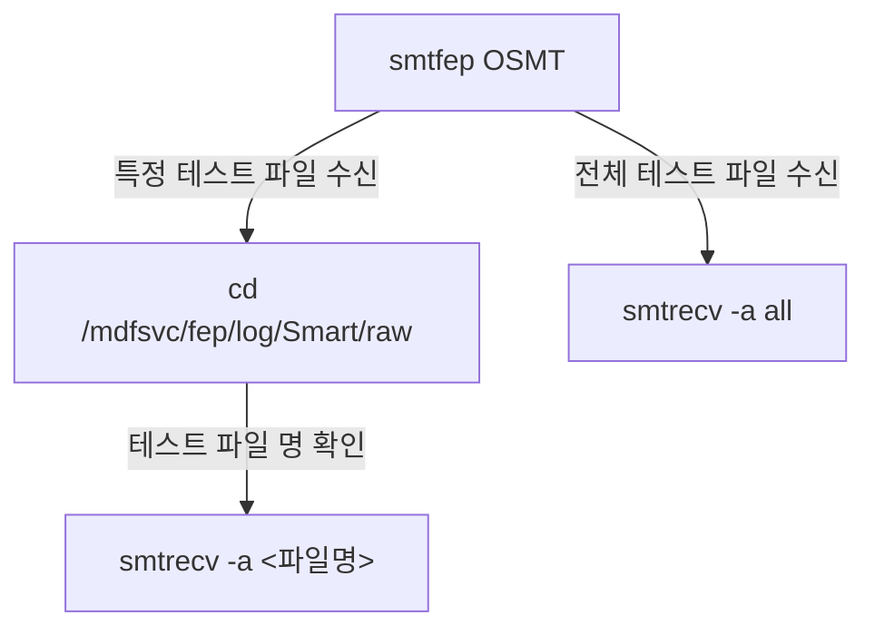
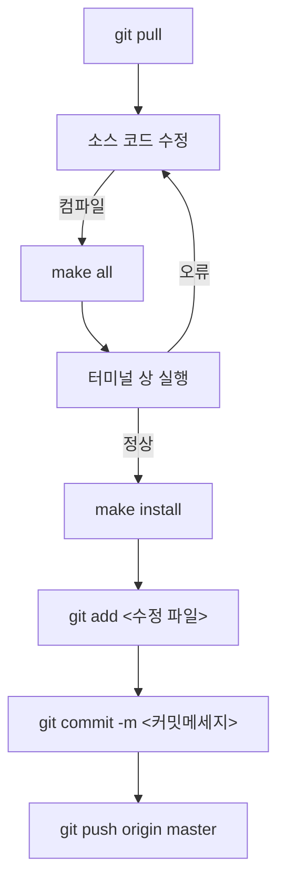

# NASDAQ Smart Option

## 목차
- [NASDAQ Smart Option](#nasdaq-smart-option)
  - [목차](#목차)
  - [1. NASDAQ Smartoption Spec Sheet](#1-nasdaq-smartoption-spec-sheet)
    - [1.1. Data 수신 프로토콜](#11-data-수신-프로토콜)
    - [1.2. Data 포맷](#12-data-포맷)
  - [2. 구현 프로세스](#2-구현-프로세스)
    - [2.1. 사용 거래소](#21-사용-거래소)
    - [2.2. 수신 프로세스(smtrecv)](#22-수신-프로세스smtrecv)
      - [2.2.1. Command](#221-command)
    - [2.3. 가공 프로세스(smtfep)](#23-가공-프로세스smtfep)
      - [2.3.1. Command](#231-command)
  - [3. Nasdaq Smart Option 테스트 데이터](#3-nasdaq-smart-option-테스트-데이터)
    - [3.1. Nasdaq Smart Option 테스트 데이터 다운로드](#31-nasdaq-smart-option-테스트-데이터-다운로드)
    - [3.2. Nasdaq Smart Option 테스트 데이터 사용법](#32-nasdaq-smart-option-테스트-데이터-사용법)
  - [4. Nasdaq Smart Option Raw Data 확인](#4-nasdaq-smart-option-raw-data-확인)
  - [5. 소스파일](#5-소스파일)
    - [5.1. 위치](#51-위치)
    - [5.2. 수정 방법](#52-수정-방법)

## 1. NASDAQ Smartoption Spec Sheet

### 1.1. Data 수신 프로토콜
- [MoldUDP64](./docs/MOLDUDP64.md)
- [SoupBinTCP](./docs/SOUPBINTCP.md)


### 1.2. Data 포맷
- [Data Types](./docs/DATA_TYPE.md)
- [Message Format](./docs/MESSAGE_FORMAT.md)


## 2. 구현 프로세스
### 2.1. 사용 거래소
|Field|Value|
|--:|:--|
|Exchange Name|OSMT|
|Exchange ID|83|
|Type|Option|

### 2.2. 수신 프로세스(smtrecv)
#### 2.2.1. Command
```plaintext
Usage:
  smtrecv [Options]
  smtrecv <exchange_name> <port_name>

Options:
  --analyze <filename>      Perform analysis
  -a <filename>             Perform analysis

  --analyze all             Perform analysis on all files in /mdfsvc/fep/log/Smart/raw
  -a all                    Perform analysis on all files in /mdfsvc/fep/log/Smart/raw

Arguments:
  <exchange_name>  Name of the exchange
  <port_name>      Port name for the exchange

```

### 2.3. 가공 프로세스(smtfep)
#### 2.3.1. Command
```plaintext
Usage:
  smtfep <exchange_name>
```

## 3. Nasdaq Smart Option 테스트 데이터
### 3.1. Nasdaq Smart Option 테스트 데이터 다운로드
1. [Nasdaq Smart Option 테스트 데이터 웹사이트 이동](https://emi.nasdaq.com/Options/Nasdaq%20Smart%20Options/)
2. 원하는 파일명 확인
3. (서버 상에서) cd /mdfsvc/fep/log/Smart/raw/
4. (서버 상에서) wget https://emi.nasdaq.com/Options/Nasdaq%20Smart%20Options/<원하는 파일명>
5. (서버 상에서) 압축해제
6. (서버 상에서) 압축파일은 삭제

### 3.2. Nasdaq Smart Option 테스트 데이터 사용법


## 4. Nasdaq Smart Option Raw Data 확인
1. Raw 데이터는 csv 파일로 저장하므로, Jupyter 노트북을 사용한다.
2. [CME32 Nasdaq Smartoption 용 Jupyter Notebook 이동](http://121.50.18.165:8888/tree/src/FEP/SMART/jupyter)(사내에서만 접속 가능함)
3. 원하는 주피터 노트북 파일 클릭
4. pd.read_csv 에 분석하고자 하는 csv 파일명 기입
5. "Run" -> "Run All Cells" 클릭 후 데이터 확인

## 5. 소스파일
### 5.1. 위치
```plaintext
  [서버명]:/mdfsvc/src/FEP/SMART/
```

### 5.2. 수정 방법

---
© 2024 Corise Technology.
