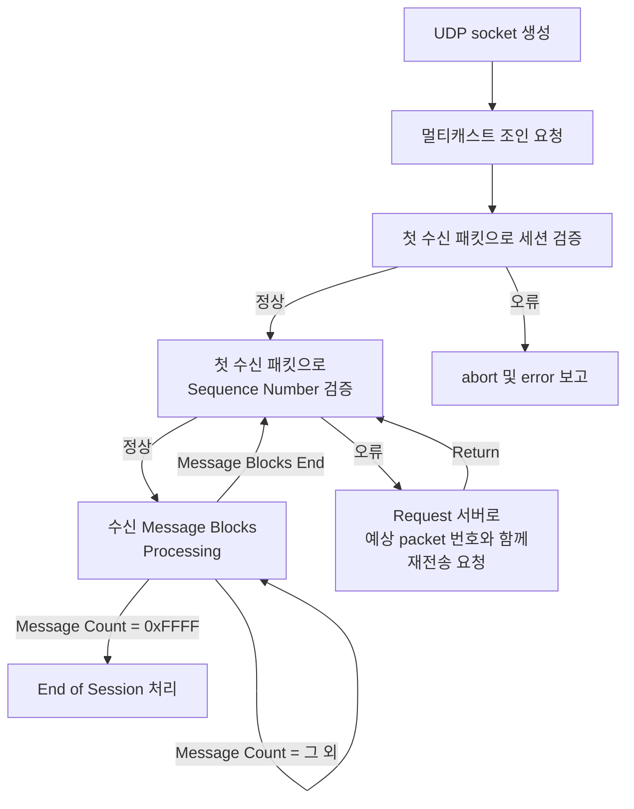

# MoldUDP64 Protocol

- [MoldUDP64 Protocol](#moldudp64-protocol)
  - [목차](#목차)
  - [1. 개요](#1-개요)
  - [2. 참고사항](#2-참고사항)
  - [3. 용어 정리](#3-용어-정리)
    - [3.1. Message](#31-message)
    - [3.2. Session](#32-session)
  - [4. Downstream Packet](#4-downstream-packet)
    - [4.1. Packet Header](#41-packet-header)
      - [4.1.1. Sequence Number](#411-sequence-number)
      - [4.1.2. Message Count](#412-message-count)
        - [1) Heartbeats](#1-heartbeats)
        - [2) End of Session](#2-end-of-session)
    - [4.2. Message Block](#42-message-block)
      - [4.2.1. Message Length](#421-message-length)
      - [4.2.2. Message Data](#422-message-data)
  - [5. Request Packet](#5-request-packet)
    - [5.1. Sequence Number](#51-sequence-number)
    - [5.2. Requested Message Count](#52-requested-message-count)
  - [6. 클라이언트 구현 방식 예시](#6-클라이언트-구현-방식-예시)
    - [6.1. Parameter 종류](#61-parameter-종류)
    - [6.2. Flow Chart](#62-flow-chart)

## 목차

## 1. 개요
- MoldUDP64는 다중 클라이언트 전송 프로토콜이다. UDP 기반으로 작동한다.
- 각각의 송신 패킷은 오직 한 번만 전송된다. 한 개의 송신 패킷 내에 여러개의 메세지가 담겨져 있다. 
- 해당 프로토콜은 Donwstream 패킷을 UDP Multicast 방식으로 전송한다.
- 클라이언트가 Request 패킷을 Nasdaq 서버쪽으로 발송할 경우 UDP Unicast 방식으로도 발송한다. 이 경우는 패킷 손실 발생 시 해당 패킷을 재 요청하기 위해 사용된다.(=Snapshot)

## 2. 참고사항
- 해당 문서에 표기되어있는 모든 number fields는 빅 엔디안 이진 포맷이다. 
- 해당 규칙은 **Message Block 내 Message Data**에는 적용할 필요는 없다.

## 3. 용어 정리
### 3.1. Message
- MoldUDP64는 이론적으로 각각의 메세지를 64KB까지 처리할 수 있으나, 패킷 전송의 효율성을 위해 메세지의 크기를 작게 유지한다.

### 3.2. Session
- 세션은 메세지의 시퀀스이다. 
- 단일 세션은 무기한으로 계속될 수 있지만, 일반적으로 어플리케이션은 시간 제한을 두고 놀리적인 그룹 메세지로 세션을 정의한다. 
- 한 번 세션이 종료되면 해당 세션으로 더 이상 메시지를 보낼 수 없다.
- MoldUDP64 시스템 및 응용 프로그램의 설계에 따라 종료된 세션에서도 수신자는 메시지를 다시 요청할 수 있다.
- 세션은 시작되었지만 아직 종료되지 않았다면 **Active Session"으로 간주한다.

## 4. Downstream Packet
- MoldUDP64 전송단에서는 **"Downstream"** 이라는 명칭의 패킷을 수신단으로 전송한다.
- 해당 패킷은 여러 개의 Data Stream Message를 포함한다.
- 각각의 MoldUDP64 packet은 아래와 같은 구성으로 이루어져 있다:

|MoldUDP64 Packet|->|->|->|->
|:--:|:--:|:--:|:--:|:--:|
|[Packet Hedaer](#41-packet-header)|[Message Block 1](#42-message-block)|[Message Block 2](#42-message-block)|[Message Block 3](#42-message-block)|***|

- Message Block은 실데이터를 담고 있다.

### 4.1. Packet Header
|Field Name|Offset|Len|Value|Notes|
|:--:|:--:|:--:|:--:|:--|
|Session|0|10|ANUM|해당 패킷이 속해있는 Session번호를 나타낸다|
|[Sequence Number](#411-sequence-number)|10|8|NUM|해당 패킷이 가진 첫 번째 메세지의 시퀀스 번호를 표시한다|
|[Message Count](#412-message-count)|18|2|NUM|해당 패킷이 갖고있는 메세지의 총 개수를 표시한다|

#### 4.1.1. Sequence Number
- 해당 패킷의 첫 번째 Message Block에 대한 시퀀스 넘버를 나타낸다.
- 만약 해당 패킷이 한 개 이상의 Message Block을 가지고 있다면, 해당 필드에 표기된 Sequence 값에 이어서 다음 Message Block들의 sequence를 표기해야 한다.

#### 4.1.2. Message Count
- 해당 패킷에 담긴 Message Block의 총 개수를 의미한다. 
- Downstream Packet의 최대 Payload Size는 전송단에서 결정한다.
- 다음 값들의 경우 특정 의미를 나타낸다:

|Value|Explantion|
|:--:|:--:|
|0|[Heartbeat](#1-heartbeats)|
|0xFFFF(=65535)|[End of session](#2-end-of-session)|

##### 1) Heartbeats
- Hearbeat는 주기적으로 서버에서 클라이언트쪽으로 발송한다. 해당 패킷으로 클라이언트는 Packet 손실을 감지할 수 있다.
- 일반적으로 해당 패킷은 1초당 한 번 전송되며, 다음 예상되는 시퀀스 숫자를 포함하고 있다.
- Heartbeat Packet은 **[Message Count](#412-message-count) 값이 0이다.**

##### 2) End of Session
- 현재 세션이 완료되면, Downstream Packet은 **[Message Count](#412-message-count) 값을 0xFFFF**로 세팅하여 [Heartbeats](#1-heartbeats) 대신 발송된다.
- 해당 패킷은 다음 예상되는 시퀀스 숫자를 포함하고 있으며, 이는 Heartbeat와 유사하다.
- End of Session 메세지가 지속되는 동안, 재 전송 Request는 현 세션에서 생성이 가능하다.

### 4.2. Message Block
- 첫 번째 필드는 해당 메세지의 길이를 나타낸다. 두 번째 필드인 Message Data의 총 길이를 나타낸다.

|Field Name|Offset|Len|Value|Notes|
|:--:|:--:|:--:|:--:|:--|
|[Message Length](#421-message-length)|Variable|2|NUM|Message Block 내 Message Data의 bytes 값을 나타낸다.
|[Message Data](#422-message-data)|Variable|Variable|ANUM|Message Data

#### 4.2.1. Message Length
- Unsigned 이진 데이터 방식으로 기입되어있다.
- 해당 필드는 'Message Length' 필드의 자체 길이 값인 2를 포함하지 않는다. 순수 'Message Data' 길이를 나타낸다.
- 따라서, 메세지 Block의 전체 크기는 **[Message Length 필드의 값 + 2]** 를 해주어야 한다.

#### 4.2.2. Message Data
- MoldUDP64에서 제공되는 실제 데이터를 의미한다.
- 해당 필드의 길이는 0이 될 수도 있다.

## 5. Request Packet
- Request Packet은 특정 메세지에 대하여 서버측에 재전송을 요청하는 패킷이다.
- 클라이언트측은 Sequence Number에 갭이 발생했다고 여겨질 경우 해당 패킷으로 재전송을 요청해야한다.
- 해당 패킷을 정확하게 전송했을 경우, 표준 Downstream Packet Unicast로 응답한다.
- 이러한 방식은 해당 프로토콜의 사용자들이 현재 사용 중인 Multicast Processing 소켓으로 재전송 데이터를 읽을 수 있도록 한다.
- 즉, 클라이언트측에서는 오직 한 개의 소켓으로 멀티캐스트 수신 및 재전송 프로세싱을 수행해야 한다. 

|Field Name|Offset|Len|Value|Notes|
|:--:|:--:|:--:|:--:|:--|
|Session|0|10|ANUM|해당 패킷이 속한 Session Number|
|[Sequence Number](#51-sequence-number)|10|8|NUM|재전송 요청 메세지들 중   첫 번째 메세지의 Sequence Number|
|[Requested Message Count](#52-requested-message-count)|18|2|NUM|재전송 요청하 메세지들의 총 개수|

### 5.1. Sequence Number
- 재 전송을 요청한 메세지들 중에서 첫 번째 Sequence Number을 의미한다.

### 5.2. Requested Message Count
- 재전송을 요청하려고 하는 메세지들의 총 개수를 의미한다.
- 만일 재전송 요청 메세지들을 합산한 [payload가 최대치](#412-message-count)를 초과할 경우, 최대치 까지만 재전송 요청 메세지를 전송한다.
- 따라서 이러한 경우 추가로 재전송 Request를 발송해야 한다.

## 6. 클라이언트 구현 방식 예시
### 6.1. Parameter 종류
|Parameter|Notes|
|:--:|:--:|
|UDP port|Multicast Group에 조인을 위한 Port|
|Request Server의   HOST IP/PORT|재전송 요청 Request 발송을 위한   Request Server의 IP/PORT정보|
|Session & Sequence Number|클라이언트 측에서 재시작 할 경우,   다음 예상 메세지의 Session과 Sequence Number을 참고해야함.|

### 6.2. Flow Chart

---

*Note: 이 문서는 Smartoption MoldUDP64 프로토콜에 대한 규칙을 설명합니다.*
