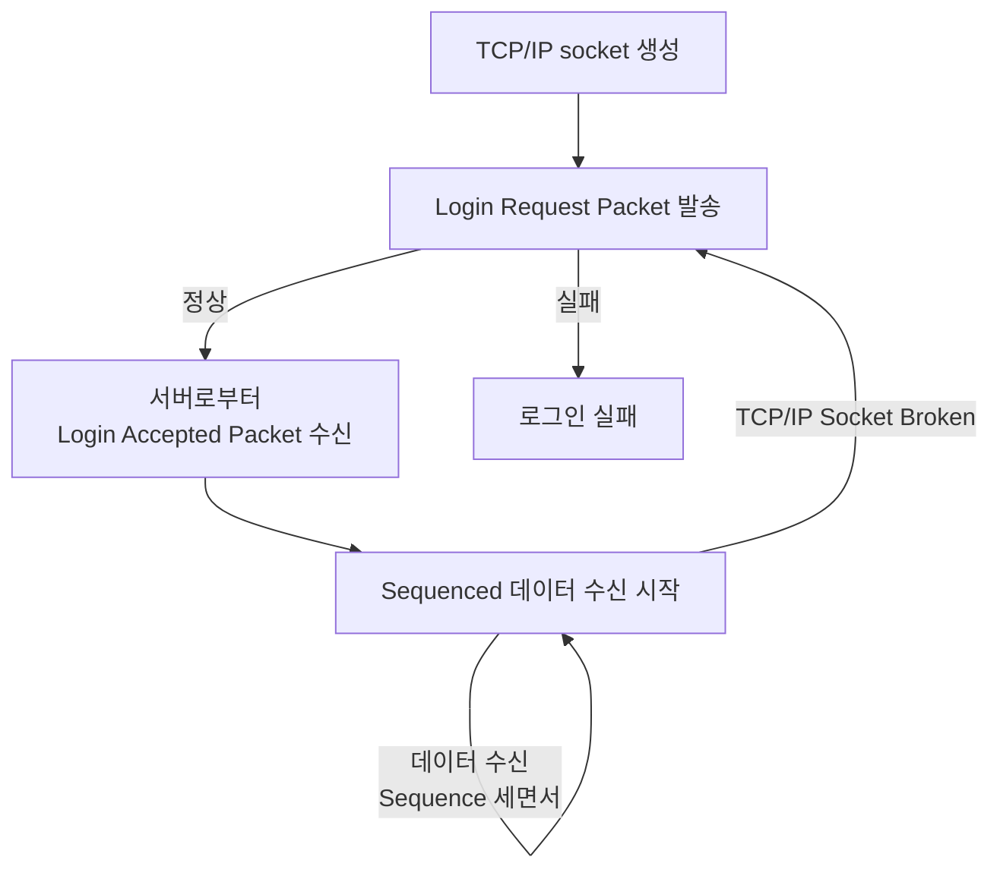

# SoupBinTCP Protocol

## 목차
- [SoupBinTCP Protocol](#soupbintcp-protocol)
  - [목차](#목차)
  - [1. 개요](#1-개요)
    - [1.1. SoupBinTCP Logical Packets(개념 설명)](#11-soupbintcp-logical-packets개념-설명)
      - [1.1.1 Logical Packets](#111-logical-packets)
      - [1.1.2. Protocol Flow](#112-protocol-flow)
        - [1.1.2.1 Sequenced 데이터](#1121-sequenced-데이터)
        - [1.1.2.2. Login Request Packet](#1122-login-request-packet)
        - [1.1.2.3. 재로그인](#1123-재로그인)
        - [1.1.2.4. 클라이언트 측 패킷 전송](#1124-클라이언트-측-패킷-전송)
      - [1.1.3. Heartbeats](#113-heartbeats)
        - [1.1.3.1. 서버 측](#1131-서버-측)
        - [1.1.3.2. 클라이언트 측](#1132-클라이언트-측)
      - [1.1.4. End of Session Marker](#114-end-of-session-marker)
      - [1.1.5. Data Typs](#115-data-typs)
  - [2. SoupBinTCP Packet 종류](#2-soupbintcp-packet-종류)
    - [2.1. Debug Packet("+")](#21-debug-packet)
    - [2.2. 서버측에서 발송하는 패킷](#22-서버측에서-발송하는-패킷)
      - [2.2.1. Login Accepted Packet("A")](#221-login-accepted-packeta)
      - [2.2.2. Login Rejected Packet("J")](#222-login-rejected-packetj)
        - [2.2.2.1. Reject Code](#2221-reject-code)
      - [2.2.3. Sequenced Data Packet("S")](#223-sequenced-data-packets)
      - [2.2.4. Server Heartbeat Packet("H")](#224-server-heartbeat-packeth)
      - [2.2.5. End of Session Packet("Z")](#225-end-of-session-packetz)
    - [2.3. 클라이언트 측에서 발송하는 패킷](#23-클라이언트-측에서-발송하는-패킷)
      - [2.3.1. Login Request Packet("L")](#231-login-request-packetl)
      - [2.3.2 Unsequenced Data Packets("U")](#232-unsequenced-data-packetsu)
      - [2.3.3. Client Heartbeat Packet("R")](#233-client-heartbeat-packetr)
      - [2.3.4. Logout Request Packet("O")](#234-logout-request-packeto)

## 1. 개요
- SoupBinTCP는 TCP/IP 기반으로 작동하는 1대1 Real Time 데이터 전송 프로토콜이다.
- 해당 프로토콜의 클라이언트는 서버측으로 메세지를 전송할 수 있다. 해당 메세지는 순차적이지 않으며, TCP/IP socket failure가 발생할 경우 손실이 발생할 수 있다.
- 로그인 절차가 있다
  

### 1.1. SoupBinTCP Logical Packets(개념 설명)
- SoupBinTCP 클라이언트와 서버는 일련의 [logical packets](#11-soupbintcp-logical-packets)을 주고받으며 통신한다.

#### 1.1.1 Logical Packets
|Field|Length|Note|
|:--:|:--:|:--|
|Packet Length|2|해당 필드를 제외한 나머지 필드들의 총 길이 값(빅엔디안)|
|Packet Type|1|해당 패킷의 Type|
|Payload|Variable|**'Packet Length'** - 1

***Note.***  
***1) 이론적으로는 위의 방식을 따르지만, 실제로 전송된 데이터는 잘려 있을 수가 있다.   (예를들어 Packet Type까지만 전송되어 Payload는 못받은 경우)   2) [***패킷의 종류 참고***](#2-soupbintcp-packet-종류)***

#### 1.1.2. Protocol Flow

##### 1.1.2.1 Sequenced 데이터
- 패킷 내에 Sequence 에 관한 정보가 없으므로 로컬에서 시퀀스 번호를 직접 세야한다.
- 첫 수신 메세지는 무조건 시퀀스 1 부터 시작한다.
- [Sequenced Data Packet 참고](#223-sequenced-data-packets)  

##### 1.1.2.2. Login Request Packet
- 초기 로그인 시 클라이언트는 아래와 같이 Login Request Packet을 생성한다: 

|Packet Length|Packet Type|Payload|
|:--:|:--:|:--:|
|1|Blank|

___[Login Accepted Packet 참고](#221-login-accepted-packeta)___  
___[Login Rejected Packet 참고](#222-login-rejected-packetj)___

##### 1.1.2.3. 재로그인
- TCP/IP 연결이 끊어진 경우, 클라이언트는 현재 세션과 Sequence Number를 토대로 서버로부터 재 로그인을 시도하여 데이터를 끊임 없이 받을 수 있다.

##### 1.1.2.4. 클라이언트 측 패킷 전송
- 클라이언트는 서버로 unsequenced Data Packets을 언제든지 발송할 수 있다.(단, 로그인 절차를 마친 후에)
- 해당 패킷은 TCP/IP 연결에 에러가 있을 경우 손실될 수 있다.

#### 1.1.3. Heartbeats
##### 1.1.3.1. 서버 측
- Link 실패를 감지하고자 해당 패킷이 사용된다.
- 서버가 마지막으로 데이터를 보낸 시점에서 1초가 경과되면 [Server Heartbeat](#224-server-heartbeat-packeth) 패킷을 발송한다.
- 클라이언트측에서 만일 일정 시간이 경과되도록 [Server Heartbeat](#224-server-heartbeat-packeth)을 수신하지 못한다면, link가 끊어졌다는 의미이므로 재연결을 시도해야 한다.

##### 1.1.3.2. 클라이언트 측
- 클라이언트 측에서도 로그인 이후에는 적어도 1초에 한 번씩은 서버측으로 [Client Heartbeat](#233-client-heartbeat-packetr) 메세지를 보내주어야 한다.
- 서버측에서 만일 일정 시간이 경과되도록(약 15초)해당 메세지를 받지 못한다면, 소켓 연결을 끊는다. 

#### 1.1.4. End of Session Marker
- 서버측은 [End of Session Message](#225-end-of-session-packetz)를 통해 현 세션이 종료되었음을 알린다.
- 클라이언트측은 반드시 새로운 Session ID나 Session ID 필드를 공백처리 한 채로 재연결 및 재로그인을 시도해야한다.

#### 1.1.5. Data Typs 
- 문자 필드는 표준 ASCII 바이트로 처리된다.
- 정수형 필드는 Big Endian Binary로 처리된다.

 

## 2. SoupBinTCP Packet 종류
### 2.1. Debug Packet("+")
- 서버와 클라이언트 측 둘다 해당 패킷을 언제든지 전송할 수 있다.
- Human Readable한 문자열을 제공하며, 디버깅 문제를 돕기위한 목적으로 사용된다.
- ___**해당 패킷은 반드시 서버와 클라이언트 측에서는 무시되어야 한다.**___

|Name|Offset|Len|Value|Note|
|:--:|:--:|:--:|:--:|:--|
|Packet Length|0|2|Integer|이 필드를 제외한 나머지 부분의 길이|
|Packet Type|2|1|"+"|"+"(Debug Packet)
|Text|3|Variable|Alpha-numeric|자유형식(Human Readable)|

### 2.2. 서버측에서 발송하는 패킷
#### 2.2.1. Login Accepted Packet("A")
|Name|Offset|Len|Value|Note|
|:--:|:--:|:--:|:--:|:--|
|Packet Length|0|2|Integer|이 필드를 제외한 나머지 부분의 길이|
|Packet Type|2|1|"A"|"A"(Login Accepted Packet)|
|Session|3|10|Alpha-numeric|로그인된 세션의 ID   오른쪽 정렬이며, 왼쪽은 SPACE 패딩
|Sequence Number|13|20|Numeric|다음 전송 될 메세지의 Sequence 번호.  ASCII 형식이며, 왼쪽 SPACE 패딩이다.

#### 2.2.2. Login Rejected Packet("J")
|Name|Offset|Len|Value|Note|
|:--:|:--:|:--:|:--:|:--|
|Packet Length|0|2|Integer|이 필드를 제외한 나머지 부분의 길이|
|Packet Type|2|1|"J"|"J"(Login Rejected Packet)|
|Reject Reason Code|3|1|Alpha|[Reject Code 참고](#231-reject-code)

##### 2.2.2.1. Reject Code
|Name|Explanation|
|:--:|:--:|
|"A"|허가받지 않음. ID 또는 Password 오류|
|"S"|Session이 올바르지 않음.   로그인 Request 패킷 내 Session 정보가 올바르지 않거나, 사용할 수 없음.

#### 2.2.3. Sequenced Data Packet("S")
- 해당 패킷은 서버에서 클라이언트 측으로 전송되는 Sequence 메세지용으로 사용된다.
- 첫 번째 시퀀스는 [Login Accepted Packet](#22-login-accepted-packeta)으로 지정한다.
- 그 이후의 메세지마다 Sequence는 1씩 증가한다.
- TCP/IP 연결 및 데이터 정상 수신 이후, 패킷 손실이 발생하는 경우는 오직 Connection Error밖에는 없다. 이 경우, 자체적으로 계산한 Sequence 번호와 함께 서버측으로 재연결을 요청하여야 한다.

|Name|Offset|Len|Value|Note|
|:--:|:--:|:--:|:--:|:--|
|Packet Length|0|2|Integer|이 필드를 제외한 나머지 부분의 길이|
|Packet Type|2|1|"S"|"S"(Sequenced Data Packet)|
|Message|3|Variable|Any|Defined by higher-level protocol|

#### 2.2.4. Server Heartbeat Packet("H")
- 서버는 데이터가 없을 때 적어도 1초에 한 번씩은 Heartbeat Packet을 클라이언트 측으로 전송한다. 
- 클라이언트측에서는 일정기간동안 해당 데이터를 수신하지 못하는 경우 연결이 끊어진 것으로 간주한다.
  
|Name|Offset|Len|Value|Note|
|:--:|:--:|:--:|:--:|:--|
|Packet Length|0|2|Integer|이 필드를 제외한 나머지 부분의 길이|
|Packet Type|2|1|"H"|"H"(Server Heartbeat Packet)|

#### 2.2.5. End of Session Packet("Z")
- 서버는 현 세션 종료를 알리고자 End of Session Packet을 발송한다.
- 해당 패킷 이후 연결은 끊어질 예정이며, 사용자는 더 이상 해당 세션으로의 연결이 불가하다.

|Name|Offset|Len|Value|Note|
|:--:|:--:|:--:|:--:|:--|
|Packet Length|0|2|Integer|이 필드를 제외한 나머지 부분의 길이|
|Packet Type|2|1|"Z"|"Z"(End of Session Packet)|

### 2.3. 클라이언트 측에서 발송하는 패킷
#### 2.3.1. Login Request Packet("L")
- 클라이언트는 반드시 서버와의 TCP/IP 소켓 연결이 확인되면 Login Request Packet을 즉시 발송해야 한다.
- 클라이언트는 반드시 올바른 ID/Password를 사용해야 한다.
- **ID와 Password는 대소문자 상관없이 작성하고, 오른쪽을 space 패딩해야 한다.**
- 서버는 소켓 연결 후 30초 이상 Login Request Packet이 수신되지 않을 경우 연결을 종료한다.

|Name|Offset|Len|Value|Note|
|:--:|:--:|:--:|:--:|:--|
|Packet Length|0|2|Integer|이 필드를 제외한 나머지 부분의 길이|
|Packet Type|2|1|"L"|"L"(Login Request Packet)|
|Username|3|6|Alphanumeric|ID|
|Password|9|10|Alphanumeric|Password|
|Requested Session|19|10|Alphanumeric|로그인 할 Session 을 명시하거나,   blank처리하여 현재 Active한 세션으로 로그인|
|Requested Seqeunce Number|29|20|Numeric|클라이언트 측에서 수신하길 원하는 다음 sequence 번호를 ASCII 형식으로 전달.   가장 최신 데이터를 수신하고 싶은 경우에는 0을 주면 됨.

#### 2.3.2 Unsequenced Data Packets("U")
- 클라이언트에서 서버측으로 데이터 전송 시 사용하는 패킷이다.
- 해당 메세지는 순차적이지 않으며, Socket에서 발생하는 에러 시에만 패킷 손실이 발생한다.

|Name|Offset|Len|Value|Note|
|:--:|:--:|:--:|:--:|:--|
|Packet Length|0|2|Integer|이 필드를 제외한 나머지 부분의 길이|
|Packet Type|2|1|"U"|"U"(Unsequenced Data Packet)|
|Message|3|Variable|Any|Defined by higher-level protocol|

#### 2.3.3. Client Heartbeat Packet("R")
- 클라이언트는 데이터가 없을 경우 1초에 한 번씩 Heartbeat Packet을 발송해야 한다.
- 서버는 일정 시간동안 해당 패킷을 수신하지 못할 경우 연결 종료로 인식한다.

|Name|Offset|Len|Value|Note|
|:--:|:--:|:--:|:--:|:--|
|Packet Length|0|2|Integer|이 필드를 제외한 나머지 부분의 길이|
|Packet Type|2|1|"R"|"R"(Login Request Packet)| 

#### 2.3.4. Logout Request Packet("O")
- 클라이언트는 연결 종료를 원할 때, Logout Request 패킷을 발송한다.
- 서버는 해당 패킷 수신 즉시 연결을 종료한다.

|Name|Offset|Len|Value|Note|
|:--:|:--:|:--:|:--:|:--|
|Packet Length|0|2|Integer|이 필드를 제외한 나머지 부분의 길이|
|Packet Type|2|1|"O"|"O"(Logout Request Packet)| 

---

*Note: 이 문서는 Smartoption SoupBinTCP 프로토콜에 대한 규칙을 설명합니다.*